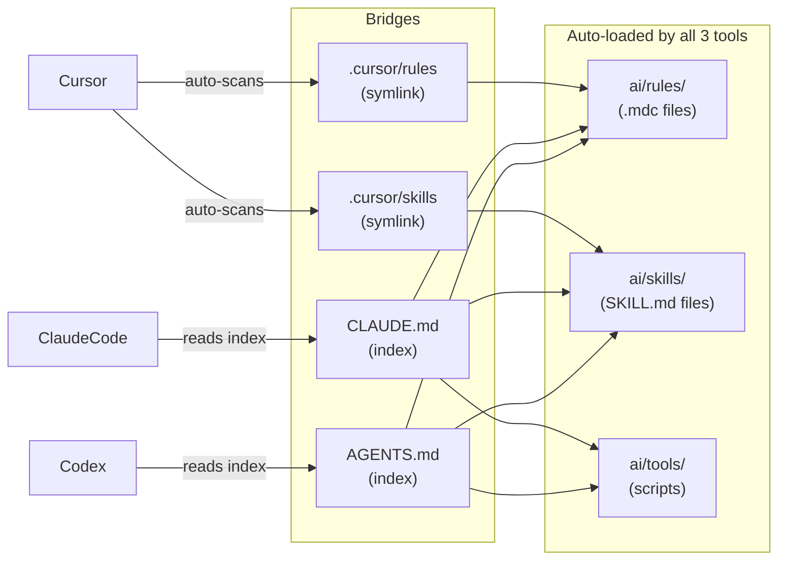

# homebrew-wt-setup

Homebrew tap for `wt` — a git worktree manager with shared AI context.

`wt setup` bootstraps a fully isolated workspace per project: clones the repo, creates a shared `context/` folder with AI documentation templates, and symlinks it into the main repo and every worktree automatically. All subsequent `wt <branch>` commands keep new worktrees in sync.

Each project is self-contained. You can run `wt setup` for as many repos as you like — they never share state.

---

## Install

```sh
brew install rejsiperpalaj/wt-setup/wt-setup
```

Then add shell integration to `~/.zshrc` (shown in the caveats after install):

```sh
echo 'source "/opt/homebrew/share/wt/shell-integration.zsh"' >> ~/.zshrc
source ~/.zshrc
```

---

## Quick start

```sh
cd ~/Documents/workspace          # or any directory you use for projects
wt setup git@github.com:your-org/your-repo.git
```

This creates:

```
~/Documents/workspace/
└── wt_your-repo/
    ├── your-repo/                 ← git clone (main worktree)
    │   ├── .cursor  →  ../context/.cursor      (symlink)
    │   ├── ai       →  ../context/ai           (symlink)
    │   ├── CLAUDE.md → ../context/CLAUDE.md   (symlink)
    │   └── AGENTS.md → ../context/AGENTS.md   (symlink)
    ├── your-repo.worktrees/       ← feature branch worktrees land here
    └── context/                   ← shared AI docs (never committed)
        ├── .cursor/
        │   ├── rules  → ../ai/rules   (symlink — Cursor bridge)
        │   ├── skills → ../ai/skills  (symlink — Cursor bridge)
        │   └── mcp.json → ../mcp.json (symlink — Cursor MCP bridge)
        ├── ai/                    ← single source of truth
        │   ├── rules/             ← rules (.mdc files) — loaded by all 3 tools
        │   │   ├── project.mdc
        │   │   ├── architecture.mdc
        │   │   ├── coding-standards.mdc
        │   │   ├── testing.mdc
        │   │   └── workflows.mdc
        │   ├── skills/            ← task templates (SKILL.md files)
        │   │   └── README.md
        │   └── tools/             ← scripts used by skills and rules
        │       └── README.md
        ├── mcp.json               ← MCP server config (Cursor + Claude Code + Codex)
        ├── CLAUDE.md              ← Claude Code bridge → ai/
        └── AGENTS.md             ← Codex bridge → ai/
```

Everything is symlinked into the main repo and every worktree. Edit any file from inside any checkout — changes are instantly visible everywhere.

`wt setup` also auto-detects the remote's default branch (`main`, `master`, `develop`, etc.) and stores it in the repo's local git config as `wt.defaultBranch`. All `wt <branch>` calls use it automatically.

---

## Mental model

`wt setup` creates the workspace structure and wires the doorbells — you never touch them again. Your daily work happens inside `ai/`.

| File / folder | Who manages it | Touch it? |
|---|---|---|
| `CLAUDE.md` | `wt setup` | No — thin entry point for Claude Code |
| `AGENTS.md` | `wt setup` | No — thin entry point for Codex |
| `.cursor/` | `wt setup` | No — Cursor bridge to `ai/` |
| `mcp.json` | You | Once — list your MCP servers |
| `ai/rules/*.mdc` | You | Yes — all your context lives here |
| `ai/skills/` | You | Yes — task templates |
| `ai/tools/` | You | Yes — scripts used by skills |

> Do not put content in `CLAUDE.md` or `AGENTS.md` — it will be invisible to Cursor. Put everything in `ai/rules/` instead.

---

## Daily workflow

```sh
wt TICKET-123-my-feature      # new branch → dropped into the worktree
# edit ai/rules/project.mdc   # update AI context if needed
wt --ai-status                # health check
```

That's it. Rules, skills, and MCP config are already synced to every worktree — nothing else to do.

---

## How AI tools read your context

`ai/` is the single source of truth. All three tools read `ai/rules/` and `ai/skills/` — they just reach them through different mechanisms:

- **Cursor** — path convention. It automatically scans `.cursor/rules/` and `.cursor/skills/` on startup. Those directories are symlinked to `ai/rules/` and `ai/skills/`, so Cursor picks everything up with no extra instruction.
- **Claude Code** — instruction-based. It reads `CLAUDE.md` first, which explicitly indexes `ai/rules/` and `ai/skills/`. Claude follows those references.
- **Codex** — same pattern via `AGENTS.md`.

The mechanism differs, but the destination is the same: `ai/rules/` and `ai/skills/`.



| Location | Loaded by | Role |
|---|---|---|
| `ai/rules/` | All three tools — automatically | All context: project overview, architecture, coding standards, testing, workflows |
| `ai/skills/` | All three tools — on demand | Step-by-step task templates |
| `ai/tools/` | All three tools — when a skill invokes it | Scripts and helpers referenced by skills |
| `CLAUDE.md` | Claude Code | Thin bridge — indexes the three buckets above |
| `AGENTS.md` | Codex | Thin bridge — same as CLAUDE.md |

Edit in `ai/`. One place, all tools, all worktrees, all branches.

---

## Default branch

`wt setup` detects the remote HEAD branch automatically and stores it in the repo's local git config as `wt.defaultBranch` — the standard way tools store per-repo settings, no extra files needed.

To override it at any time:

```sh
wt --set-default main          # stored in .git/config (repo-local, per-developer)
wt --set-default master

# Or set a personal global default for all projects on this machine:
git config --global wt.defaultBranch main
```

Branch resolution priority: `--from` flag → `git config wt.defaultBranch` (local before global) → remote HEAD auto-detection → `develop`.

```sh
wt my-feature              # uses stored default
wt my-feature --from main  # overrides for this branch only
```

---

## Commands

### Setup

| Command | Description |
|---|---|
| `wt setup <git-url>` | Bootstrap a new project workspace |

### Branching

Run from inside the project or any of its worktrees.

| Command | Description |
|---|---|
| `wt <branch>` | New branch off the default base branch, cd into it |
| `wt <branch> --from <base>` | New branch off `origin/<base>` |
| `wt <branch> --checkout` | Check out existing local or remote branch |

### Management

| Command | Description |
|---|---|
| `wt --list` | List all worktrees for this project |
| `wt --prune` | Prune stale worktree metadata |
| `wt --remove <branch>` | Remove a worktree and prune metadata |
| `wt --set-default <branch>` | Set the default base branch for new worktrees |

### AI context

| Command | Description |
|---|---|
| `wt --ai-status` | Symlink health check across all worktrees |
| `wt --ai-fix` | Re-link AI context in all checkouts (bridges, `.mcp.json`, top-level symlinks) |
| `wt --ai-doctor` | Scan `context/ai/` for portability drift (see below) |
| `wt --help` | Show help |

#### `wt --ai-doctor` — content drift check

`--ai-status` verifies the *symlinks* are healthy (including `context/.cursor` bridges and `.mcp.json`). `--ai-doctor` verifies the *content inside* `context/ai/rules/`, `context/ai/skills/`, and `context/ai/tools/` uses citations that resolve for all three AI tools (Cursor, Claude Code, Codex) — not just Cursor.

It flags three classes of drift:

| Finding | Why it matters | Fix |
|---|---|---|
| `.cursor/{rules,skills,tools}/…` bare-path references in prose | `.cursor/rules` and `.cursor/skills` are *Cursor-only auto-discovery symlinks* into `ai/`. There is no `.cursor/tools` at all. Claude Code and Codex silently can't follow these. | Use `ai/{rules,skills,tools}/…` |
| Legacy `mdc:` markdown-link protocol (`[text](mdc:.cursor/rules/foo.mdc)`) | Only Cursor resolves `mdc:`. In Claude Code and Codex the link is dead. | Use bare backtick paths: `` `ai/rules/foo.mdc` `` |
| Hardcoded `/Users/…` or `/home/…` absolute paths | Non-portable across developers and machines. | Use workspace-relative paths |

Run from anywhere inside the project or from the `wt_` workspace root:

```sh
wt --ai-doctor
```

Output — clean:

```
✓ Clean — no drift found.
```

Output — findings:

```
── Stale .cursor/{rules,skills,tools}/ references (use ai/... instead) (2 match(es)) ──
context/ai/rules/pre-commit-format.mdc:29: bash .cursor/tools/precommit_format.sh
context/ai/skills/triage-pr/SKILL.md:79: python3 .cursor/tools/fetch_pr_feedback.py

✗ 2 finding(s). Fix by:
  1. Replace .cursor/{rules,skills,tools}/ with ai/{rules,skills,tools}/ in prose.
  2. Replace [text](mdc:.cursor/rules/foo.mdc) with bare backticks: `ai/rules/foo.mdc`.
  3. Replace absolute host paths with workspace-relative paths.
```

Exit codes: `0` clean, `1` findings, `2` no `context/ai/` present.

Wire it into a CI check on your shared `context/` repo (per the [Team best practice](#team-best-practice--shared-ai-context-repo) below) to catch drift before it reaches other developers' machines.

---

## Working from the workspace root

All `wt` commands work from both the repo directory and the `wt_` workspace root:

```sh
cd wt_your-repo
wt --ai-status    # works — no need to cd into your-repo/ first
```

---

## How to set up skills, rules, and workflows

### Rules

Rules go in `context/ai/rules/` as `.mdc` files. Cursor finds them automatically via the `.cursor/rules → ../ai/rules` symlink. Claude Code and Codex read them because `CLAUDE.md` and `AGENTS.md` reference `ai/rules/`.

This is where all context lives — project overview, architecture, coding conventions, testing approach, workflow steps. Everything in a `.mdc` rule reaches all three tools automatically.

```
context/
└── ai/
    └── rules/
        ├── project.mdc          ← repo-wide conventions (architecture, patterns, do-nots)
        ├── testing.mdc          ← test standards
        └── api-contracts.mdc    ← API / DTO rules
```

Every `.mdc` file needs a frontmatter header:

```markdown
---
description: What this rule enforces
alwaysApply: true          # always active for every session
# globs: ["**/*.swift"]   # or scope to specific file types only
---

# Rule title

What the agent must / must not do. Be specific — reference actual
file paths, class names, and patterns from this codebase.

## Do
- ...

## Do not
- ...
```

**How each tool picks it up:**
- **Cursor** — reads all `.mdc` files in `.cursor/rules/` (the symlink to `ai/rules/`) automatically every session. No extra step.
- **Claude Code** — `CLAUDE.md` says "read `ai/rules/`". Claude reads the files there when following the bridge instructions.
- **Codex** — same via `AGENTS.md`.

---

### Skills

Skills go in `context/ai/skills/` as folders with a `SKILL.md` inside. Each skill is a reusable, step-by-step task template the agent follows on demand.

```
context/
└── ai/
    └── skills/
        ├── create-feature/
        │   └── SKILL.md   ← step-by-step: ViewModel + Service + tests
        ├── triage-pr/
        │   └── SKILL.md
        └── run-app/
            └── SKILL.md
```

`SKILL.md` structure:

```markdown
# Skill name

## When to use
One sentence — what triggers this skill.
Example: "Use when the user asks to add a new feature."

## Before you start
- Read `ai/rules/architecture.mdc` and `ai/rules/coding-standards.mdc`
- Confirm the feature scope with the user

## Steps
1. ...
2. ...
3. ...

## Output
What the agent should produce when done.
```

**How each tool picks it up:**
- **Cursor** — invoke by referencing the skill in chat: "follow the create-feature skill". Cursor reads `ai/skills/create-feature/SKILL.md` via the `.cursor/skills` symlink.
- **Claude Code / Codex** — tell the agent "follow the create-feature skill" and it reads `ai/skills/create-feature/SKILL.md` directly.

---

### Tools

Scripts used by skills go in `context/ai/tools/`. Since `ai/` is symlinked into every worktree, `ai/tools/<script>` resolves identically in the main repo and every worktree — for Cursor, Claude, and Codex.

```
ai/
└── tools/
    ├── run-simulator.sh    ← referenced by the run-ios skill
    └── trigger-build.py   ← referenced by the deploy skill
```

A skill references a tool simply:

```markdown
## Steps
1. Run `ai/tools/run-simulator.sh` to list available destinations.
2. ...
```

Make scripts executable after adding them:

```sh
chmod +x ai/tools/run-simulator.sh
```

---

### MCP servers

Put your MCP server configuration in `context/mcp.json` — the single source of truth:

```json
{
  "mcpServers": {
    "slack": {
      "command": "npx",
      "args": ["-y", "@modelcontextprotocol/server-slack"],
      "env": { "SLACK_BOT_TOKEN": "xoxb-..." }
    }
  }
}
```

`wt setup` wires this automatically to all three AI tools:

| Tool | Path | How |
|---|---|---|
| Cursor | `.cursor/mcp.json` | symlink → `context/.cursor/mcp.json` → `context/mcp.json` |
| Claude Code | `.mcp.json` | symlink → `context/mcp.json` |
| Codex | `.mcp.json` | same symlink |

Edit `context/mcp.json` once — every worktree and every AI tool picks it up instantly.

---

### The golden rule

Everything lives in `ai/rules/`, `ai/skills/`, `ai/tools/`, or `mcp.json`. Edit there — one place, all tools, all worktrees, all branches.

---

## Migrating existing AI context

`wt` keeps AI context outside the project repo. If your project already has AI docs committed, pick your scenario below.

### Scenario A: You have `.cursor/rules/*.mdc` files committed

```sh
cp -r .cursor/rules/ wt_your-repo/context/ai/rules/
cp -r .cursor/skills/ wt_your-repo/context/ai/skills/   # if exists
git rm -r .cursor/
git commit -m "chore: move AI rules to wt context/"
```

### Scenario B: You have a monolithic `CLAUDE.md` with your conventions

Split it into per-topic `.mdc` files in `context/ai/rules/`:
- Project overview → `project.mdc`
- Architecture decisions → `architecture.mdc`
- Coding standards → `coding-standards.mdc`

Then delete the originals from the repo (wt creates the bridge symlinks):

```sh
git rm CLAUDE.md AGENTS.md
git commit -m "chore: remove AI bridge files — managed via wt"
```

### Scenario C: You have `docs/ai/` or a custom folder

```sh
cp -r docs/ai/rules/ wt_your-repo/context/ai/rules/
cp -r docs/ai/skills/ wt_your-repo/context/ai/skills/
git rm -r docs/ai/
git commit -m "chore: move AI docs to wt context/"
```

### Scenario D: Starting fresh (no existing AI context)

Nothing to migrate. Fill in `context/ai/rules/project.mdc` with your project overview and you're ready.

### After any scenario

```sh
wt --ai-fix      # re-link all checkouts (bridges + .mcp.json)
wt --ai-status   # verify all symlinks are OK
```

Team members: `git pull`, then `wt --ai-fix` once.

---

## Team best practice — shared AI context repo

**Recommended:** keep your team's AI skills, rules, and workflows in a dedicated git repo and clone it as `context/`. This is the intended production setup — it gives you versioned, reviewed AI context that every team member shares, with personal additions that never leave your machine.

Instead of each developer maintaining their own `context/` templates independently, a shared repo means one place to add a new rule, and everyone gets it on the next `git pull`.

**1. Create a shared team repo** (once, by anyone on the team):

```sh
# e.g. git@github.com:myorg/team-ai-context.git
# Populate it with your shared .cursor/rules/, ai/, CLAUDE.md, AGENTS.md, etc.
```

**2. Each developer clones it into their `context/`** after running `wt setup`:

```sh
cd wt_your-repo

# Replace context/ contents with the team repo
rm -rf context
git clone git@github.com:myorg/team-ai-context.git context
```

**3. Pull updates whenever the team evolves the shared context:**

```sh
cd wt_your-repo/context
git pull
```

This way:
- Company-wide skills, rules, and workflows live in one place, versioned and reviewed like any other code.
- Each developer's `wt_<project>/context/` is a clone of that repo — never committed into the project itself.
- Personal customizations that shouldn't be shared can be added to `context/` and listed in `context/.git/info/exclude` so they stay local-only.
- New team members get the full AI setup with two commands: `wt setup` + `git clone` into `context/`.

> **Note:** After replacing `context/` with the team repo, re-run `wt --set-default <branch>` to restore the stored default branch. The setting is stored in the repo's `.git/config` (not inside `context/`), so it is never overwritten by a team repo clone.

---

## Multiple projects

Run `wt setup` from the same workspace directory for each repo:

```sh
cd ~/Documents/workspace
wt setup git@github.com:myorg/backend-api.git
wt setup git@github.com:myorg/mobile-app.git
```

Each gets its own `wt_<repo>/context/` — completely isolated, no shared state.

---

## Upgrading

```sh
brew update && brew upgrade wt-setup
```

`brew update` is required to pull the latest formula before upgrading. Without it, Homebrew may report the current version is already installed even when a newer one is available.

---

## Uninstall

```sh
brew uninstall wt-setup
sed -i '' '/wt\/shell-integration\.zsh/d' ~/.zshrc
```

---

## How it works

- All shared AI docs live in `wt_<project>/context/` — outside any git repo.
- `context/` is never committed. Git ignores it via `.git/info/exclude` (local-only, no `.gitignore` change).
- Symlinks in the main repo and each worktree point to `context/`, so editing a doc once propagates everywhere.
- `wt-core` is a plain bash script installed to `$(brew --prefix)/bin/wt-core`.
- `shell-integration.zsh` defines a `wt()` function that wraps `wt-core` and handles `cd` after setup/branch creation.
