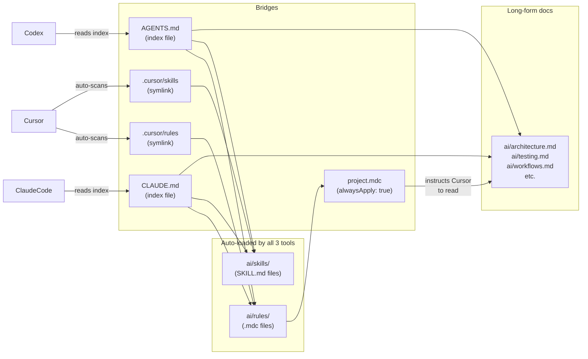

# homebrew-wt-setup

Homebrew tap for `wt` — a git worktree manager with shared AI context.

`wt setup` bootstraps a fully isolated workspace per project: clones the repo, creates a shared `context/` folder with AI documentation templates, and symlinks it into the main repo and every worktree automatically. All subsequent `wt <branch>` commands keep new worktrees in sync.

Each project is self-contained. You can run `wt setup` for as many repos as you like — they never share state.

---

## Install

```sh
brew install rejsiperpalaj/wt-setup/wt-setup
```

Then add shell integration to `~/.zshrc` (shown in the caveats after install):

```sh
echo 'source "/opt/homebrew/share/wt/shell-integration.zsh"' >> ~/.zshrc
source ~/.zshrc
```

---

## Get started

```sh
cd ~/Documents/workspace          # or any directory you use for projects
wt setup git@github.com:your-org/your-repo.git
```

This creates:

```
~/Documents/workspace/
└── wt_your-repo/
    ├── your-repo/                 ← git clone (main worktree)
    │   ├── .cursor  →  ../context/.cursor      (symlink)
    │   ├── ai       →  ../context/ai           (symlink)
    │   ├── CLAUDE.md → ../context/CLAUDE.md   (symlink)
    │   └── AGENTS.md → ../context/AGENTS.md   (symlink)
    ├── your-repo.worktrees/       ← feature branch worktrees land here
    └── context/                   ← shared AI docs (never committed)
        ├── .cursor/
        │   ├── rules  → ../ai/rules   (symlink — Cursor bridge)
        │   └── skills → ../ai/skills  (symlink — Cursor bridge)
        ├── ai/                    ← single source of truth
        │   ├── rules/             ← Cursor rules (.mdc files)
        │   │   └── project.mdc
        │   ├── skills/            ← Cursor skills (SKILL.md files)
        │   │   └── README.md
        │   ├── README.md
        │   ├── architecture.md
        │   ├── coding-standards.md
        │   ├── testing.md
        │   └── workflows.md
        ├── CLAUDE.md              ← Claude Code bridge → ai/
        └── AGENTS.md             ← Codex bridge → ai/
```

Everything is symlinked into the main repo and every worktree. Edit any file from inside any checkout — changes are instantly visible everywhere.

`wt setup` also auto-detects the remote's default branch (`main`, `master`, `develop`, etc.) and stores it in the repo's local git config as `wt.defaultBranch`. All `wt <branch>` calls use it automatically.

---

## Default branch

`wt setup` detects the remote HEAD branch automatically and stores it in the repo's local git config as `wt.defaultBranch` — the standard way tools store per-repo settings, no extra files needed.

To override it at any time:

```sh
wt --set-default main          # stored in .git/config (repo-local, per-developer)
wt --set-default master

# Or set a personal global default for all projects on this machine:
git config --global wt.defaultBranch main
```

Branch resolution priority: `--from` flag → `git config wt.defaultBranch` (local before global) → remote HEAD auto-detection → `develop`.

```sh
wt my-feature              # uses stored default
wt my-feature --from main  # overrides for this branch only
```

---

## Commands

### Setup

| Command | Description |
|---|---|
| `wt setup <git-url>` | Bootstrap a new project workspace |

### Branching

Run from inside the project or any of its worktrees.

| Command | Description |
|---|---|
| `wt <branch>` | New branch off the default base branch, cd into it |
| `wt <branch> --from <base>` | New branch off `origin/<base>` |
| `wt <branch> --checkout` | Check out existing local or remote branch |

### Management

| Command | Description |
|---|---|
| `wt --list` | List all worktrees for this project |
| `wt --prune` | Prune stale worktree metadata |
| `wt --remove <branch>` | Remove a worktree and prune metadata |
| `wt --set-default <branch>` | Set the default base branch for new worktrees |

### AI context

| Command | Description |
|---|---|
| `wt --ai-status` | Symlink health check across all worktrees |
| `wt --ai-fix` | Re-link AI context in the current directory |
| `wt --help` | Show help |

---

## Working from the workspace root

All `wt` commands work from both the repo directory and the `wt_` workspace root:

```sh
cd wt_your-repo
wt --ai-status    # works — no need to cd into your-repo/ first
```

---

## Migrating — coordinate with your team

`wt` is designed to keep AI context **outside** the project repo entirely. If your project already has `ai/`, `.cursor/`, `CLAUDE.md`, or `AGENTS.md` committed, the right move is to remove them from the repo — coordinate with your team so nobody adds them back.

**Steps (done once, by one person — then the team pulls):**

1. Run `wt setup <git-url>` to bootstrap the workspace (if not done yet).

2. Manually copy any existing AI content from the repo into `context/ai/`:

   ```sh
   cp -r ai/rules/ wt_your-repo/context/ai/rules/
   cp -r ai/skills/ wt_your-repo/context/ai/skills/
   # copy any other ai/*.md files you want to keep
   ```

3. Delete the files from git tracking:

   ```sh
   git rm -r ai/ .cursor/ CLAUDE.md AGENTS.md   # only the files that are committed
   git commit -m "chore: remove AI context from repo — managed via wt context/"
   ```

4. Everyone else on the team: `git pull`, then run `wt --ai-fix` once to re-create the symlinks in their local checkout.

After this, AI files are never committed to the project repo again. Each developer's `context/` is local-only, and all worktrees stay in sync automatically.

> **Where to put content going forward:** put architecture, testing, and workflow context in `ai/rules/` as `.mdc` files — all three tools load them automatically. If you prefer long-form `ai/*.md` docs, add a reference to each in `ai/rules/project.mdc` so Cursor picks them up too.

---

## AI tools — why CLAUDE.md, AGENTS.md, and .cursor

`ai/` is the single source of truth. All three tools read `ai/rules/` and `ai/skills/` — they just reach them through different mechanisms:

- **Cursor** — path convention. It automatically scans `.cursor/rules/` and `.cursor/skills/` on startup. Those directories are symlinked to `ai/rules/` and `ai/skills/`, so Cursor picks everything up with no extra instruction.
- **Claude Code** — instruction-based. It reads `CLAUDE.md` first, which explicitly indexes `ai/rules/` and `ai/skills/`. Claude follows those references.
- **Codex** — same pattern via `AGENTS.md`.

The mechanism differs, but the destination is the same: `ai/rules/` and `ai/skills/`.



| File / folder | Auto-loaded by | Notes |
|---|---|---|
| `ai/rules/` | All three tools | Primary home — put all context here for guaranteed auto-loading by every tool |
| `ai/skills/` | All three tools | Step-by-step task templates, invoked on demand |
| `ai/*.md` | Claude Code and Codex always; Cursor when a rule references it | `project.mdc` already references the default docs — so Cursor reads them via that rule. Any new `ai/*.md` file you add needs a reference in `project.mdc` to be visible to Cursor. |
| `CLAUDE.md` | Claude Code | Bridge — indexes `ai/rules/`, `ai/skills/`, and `ai/*.md` docs |
| `AGENTS.md` | Codex | Bridge — same as CLAUDE.md |

**The safest approach: put everything in `ai/rules/`.** Architecture notes, testing conventions, workflow steps — if they live in a `.mdc` rule, all three tools load them automatically with no indirection needed.

Edit in `ai/`. One place, all tools, all worktrees, all branches.

---

## Editing CLAUDE.md and AGENTS.md safely

`CLAUDE.md` and `AGENTS.md` are the **orchestration layer** — the first thing Claude Code and Codex read when they start in the repo. They work as a thin index pointing each tool at `ai/rules/`, `ai/skills/`, and the default `ai/*.md` docs. Editing them incorrectly will silently break tool access to everything inside `ai/`.

### What to leave alone

`wt setup` generates both files with an index section pointing at `ai/rules/` and `ai/skills/`. Do not remove or rename those entries. They are the bridge — without them, Claude and Codex will not load your rules or skills.

Do not change the paths unless you also move the actual files inside `context/ai/`.

### What you can safely add

- A short project description at the top (name, tech stack, one-paragraph summary).
- Links to external resources — Confluence, Notion, runbook URLs.
- Project-specific high-level instructions (e.g. "This is an iOS project. All code is Swift.").

### The pattern

```
CLAUDE.md / AGENTS.md
  = short project header   ← yours to edit freely
  + index pointing at ai/  ← do not touch
```

Everything inside `ai/rules/` and `ai/skills/` is yours to edit freely — that is where your conventions, do-nots, and task templates live. The bridge files are thin entry points, not the source of truth.

### Rules vs bridge files

A common mistake is adding conventions directly to `CLAUDE.md` instead of a rule. Avoid this:

```
# ❌ Wrong — put this in ai/rules/coding-standards.mdc instead
Do not use force-unwrapping in Swift.
```

```
# ✅ Right — CLAUDE.md stays thin
| Coding standards | ai/rules/coding-standards.mdc |
```

Rules in `ai/rules/` reach all three tools (Cursor, Claude, Codex) automatically. Content added only to `CLAUDE.md` is invisible to Cursor and Codex.

---

## How to set up skills, rules, and workflows

### Rules

Rules go in `context/ai/rules/` as `.mdc` files. Cursor finds them automatically via the `.cursor/rules → ../ai/rules` symlink bridge. Claude Code and Codex read them because `CLAUDE.md` and `AGENTS.md` reference `ai/rules/`.

Rules are the safest place for all context — architecture notes, coding conventions, do-nots, workflow steps. Everything in a `.mdc` rule is guaranteed to reach all three tools automatically, with no extra wiring needed.

```
context/
└── ai/
    └── rules/
        ├── project.mdc          ← repo-wide conventions (architecture, patterns, do-nots)
        ├── testing.mdc          ← test standards
        └── api-contracts.mdc    ← API / DTO rules
```

Every `.mdc` file needs a frontmatter header:

```markdown
---
description: What this rule enforces
alwaysApply: true          # always active for every session
# globs: ["**/*.swift"]   # or scope to specific file types only
---

# Rule title

What the agent must / must not do. Be specific — reference actual
file paths, class names, and patterns from this codebase.

## Do
- ...

## Do not
- ...
```

**How each tool picks it up:**
- **Cursor** — reads all `.mdc` files in `.cursor/rules/` (the symlink to `ai/rules/`) automatically every session. No extra step.
- **Claude Code** — `CLAUDE.md` says "read `ai/rules/`". Claude reads the files there when following the bridge instructions.
- **Codex** — same via `AGENTS.md`.

---

### Skills

Skills go in `context/ai/skills/` as folders with a `SKILL.md` inside. Each skill is a reusable, step-by-step task template the agent follows on demand.

```
context/
└── ai/
    └── skills/
        ├── create-feature/
        │   └── SKILL.md   ← step-by-step: ViewModel + Service + tests
        ├── triage-pr/
        │   └── SKILL.md
        └── run-app/
            └── SKILL.md
```

`SKILL.md` structure:

```markdown
# Skill name

## When to use
One sentence — what triggers this skill.
Example: "Use when the user asks to add a new feature."

## Before you start
- Read ai/architecture.md
- Confirm the feature scope with the user

## Steps
1. ...
2. ...
3. ...

## Output
What the agent should produce when done.
```

**How each tool picks it up:**
- **Cursor** — invoke by referencing the skill in chat: "follow the create-feature skill". Cursor reads `ai/skills/create-feature/SKILL.md` via the `.cursor/skills` symlink.
- **Claude Code / Codex** — tell the agent "follow the create-feature skill" and it reads `ai/skills/create-feature/SKILL.md` directly.

---

### Long-form docs (`ai/*.md`)

For content that is too long for a rule — full API references, onboarding guides, detailed architecture diagrams — you can write `ai/*.md` standalone docs.

Claude Code and Codex index and read these automatically via `CLAUDE.md` and `AGENTS.md`. Cursor reads them because `project.mdc` (which is auto-loaded) explicitly lists them under "read before writing code".

```
ai/
├── architecture.md     ← system design (already referenced by project.mdc)
├── testing.md          ← test patterns (already referenced by project.mdc)
├── workflows.md        ← git & PR process (already referenced by project.mdc)
└── deployment.md       ← new: add one reference in project.mdc for Cursor
```

When you add a new `ai/*.md` file, add one line to `ai/rules/project.mdc` so Cursor picks it up:

```markdown
- `ai/deployment.md` — release process
```

`CLAUDE.md` and `AGENTS.md` already point at `ai/` broadly — Claude and Codex find new files automatically.

> **Prefer rules for anything you want all three tools to always have in context.** Architecture notes, conventions, and workflow steps fit naturally as `.mdc` rules and reach all three tools with no extra wiring.

---

### The golden rule

Edit in `ai/`. When you add a new `ai/*.md` doc, add one reference line to `ai/rules/project.mdc`. That is all — all tools, all worktrees, all branches, one edit.

---

## Team best practice — shared AI context repo

**Recommended:** keep your team's AI skills, rules, and workflows in a dedicated git repo and clone it as `context/`. This is the intended production setup — it gives you versioned, reviewed AI context that every team member shares, with personal additions that never leave your machine.

Instead of each developer maintaining their own `context/` templates independently, a shared repo means one place to add a new rule, and everyone gets it on the next `git pull`.

**1. Create a shared team repo** (once, by anyone on the team):

```sh
# e.g. git@github.com:myorg/team-ai-context.git
# Populate it with your shared .cursor/rules/, ai/, CLAUDE.md, AGENTS.md, etc.
```

**2. Each developer clones it into their `context/`** after running `wt setup`:

```sh
cd wt_your-repo

# Replace context/ contents with the team repo
rm -rf context
git clone git@github.com:myorg/team-ai-context.git context
```

**3. Pull updates whenever the team evolves the shared context:**

```sh
cd wt_your-repo/context
git pull
```

This way:
- Company-wide skills, rules, and workflows live in one place, versioned and reviewed like any other code.
- Each developer's `wt_<project>/context/` is a clone of that repo — never committed into the project itself.
- Personal customizations that shouldn't be shared can be added to `context/` and listed in `context/.git/info/exclude` so they stay local-only.
- New team members get the full AI setup with two commands: `wt setup` + `git clone` into `context/`.

> **Note:** After replacing `context/` with the team repo, re-run `wt --set-default <branch>` to restore the stored default branch. The setting is stored in the repo's `.git/config` (not inside `context/`), so it is never overwritten by a team repo clone.

---

## Multiple projects

Run `wt setup` from the same workspace directory for each repo:

```sh
cd ~/Documents/workspace
wt setup git@github.com:myorg/backend-api.git
wt setup git@github.com:myorg/mobile-app.git
```

Each gets its own `wt_<repo>/context/` — completely isolated, no shared state.

---

## Upgrading

```sh
brew update && brew upgrade wt-setup
```

`brew update` is required to pull the latest formula before upgrading. Without it, Homebrew may report the current version is already installed even when a newer one is available.

---

## Uninstall

```sh
brew uninstall wt-setup
sed -i '' '/wt\/shell-integration\.zsh/d' ~/.zshrc
```

---

## How it works

- All shared AI docs live in `wt_<project>/context/` — outside any git repo.
- `context/` is never committed. Git ignores it via `.git/info/exclude` (local-only, no `.gitignore` change).
- Symlinks in the main repo and each worktree point to `context/`, so editing a doc once propagates everywhere.
- `wt-core` is a plain bash script installed to `$(brew --prefix)/bin/wt-core`.
- `shell-integration.zsh` defines a `wt()` function that wraps `wt-core` and handles `cd` after setup/branch creation.
